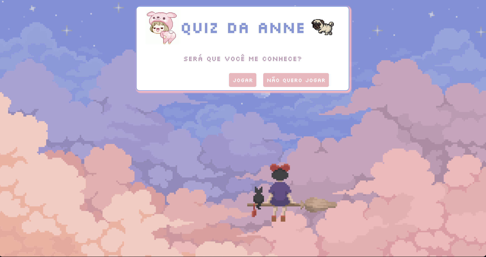
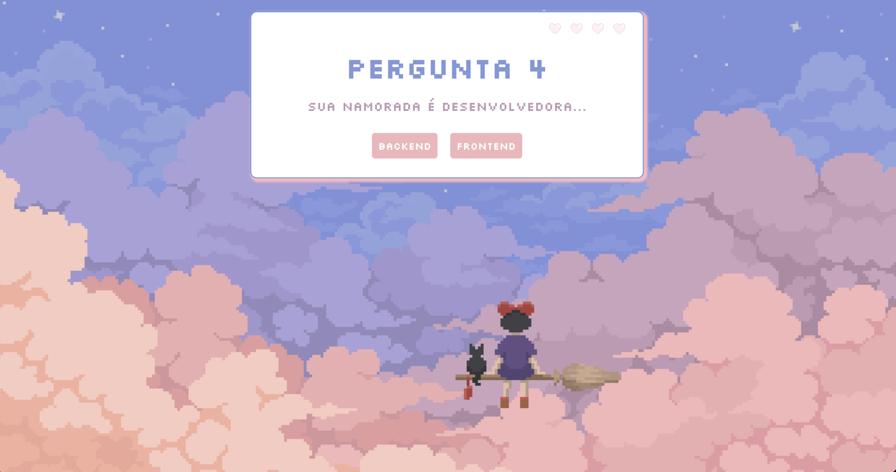
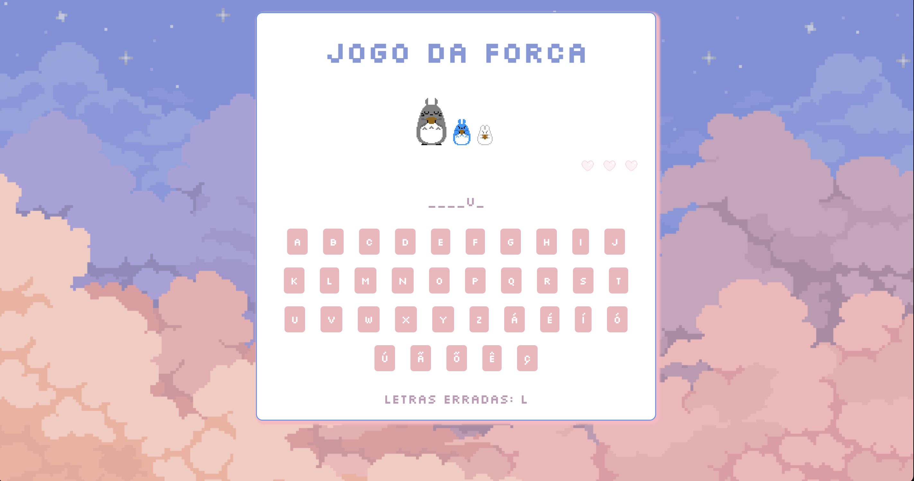
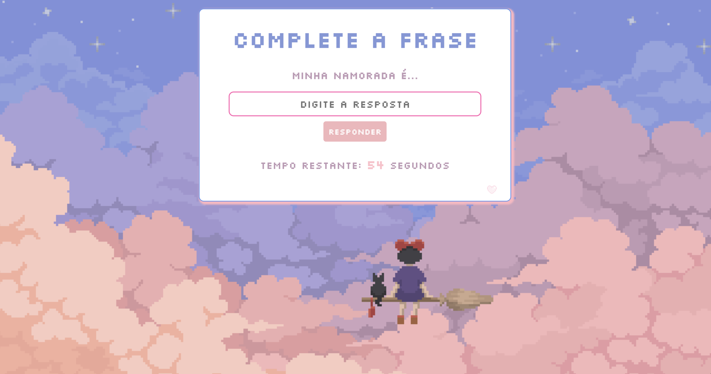
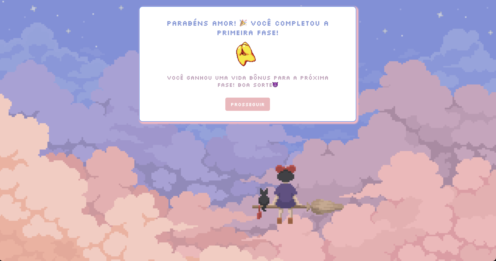
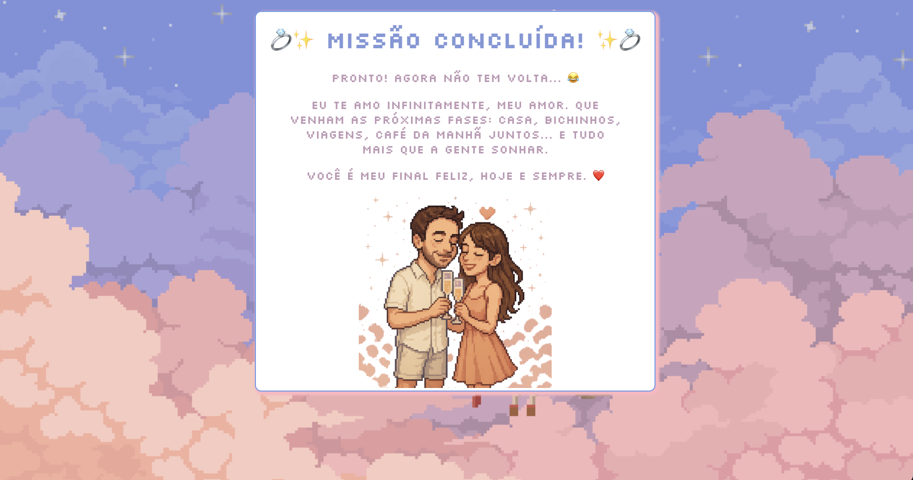

# 💘 Mini Jogo do Dia dos Namorados  

## 🎮 Como funciona
- O jogo é dividido em fases temáticas, cada uma com um estilo e desafio diferente.  
- As fases foram pensadas para criar uma pequena jornada até a mensagem final.  
- Inclui mecânicas como **quiz de perguntas**, **jogo da forca** e um **desafio com tempo**, todas adaptadas para essa ocasião especial.  

---

## 🚀 Tecnologias utilizadas
- **HTML5** → Estrutura do jogo  
- **CSS3** → Identidade visual personalizada  
- **JavaScript** → Lógica das fases e interações  

---

## 📸 Screenshots   

<p align="center">
  
  
  
</p>

<p align="center">
  
  
  
</p>


---

## 💝 Sobre este projeto
Este projeto foi feito como um presente de Dia dos Namorados para meu namorado.  
Além de ser um exercício criativo em programação, representa também uma forma única de demonstrar carinho através daquilo que mais gosto de fazer: **criar e desenvolver**.  

Se você quiser usar este jogo como **base para seus próprios projetos** ou fazer **modificações criativas**, está totalmente liberado! 🎉  

---

## ✨ Declaração Pessoal
> Este jogo é mais do que código — é um pedacinho do meu coração transformado em pixels.  
> Cada fase representa um pouco da nossa história e da forma como te vejo: alguém que merece cada esforço, cada detalhe e cada linha escrita com amor.  
> Obrigada por ser minha inspiração, minha companhia e meu maior presente.  
> Feliz Dia dos Namorados! 💖  

---

## 📂 Como executar
1. Clone este repositório:  
   ```bash
   git clone https://github.com/seu-usuario/seu-repositorio.git
